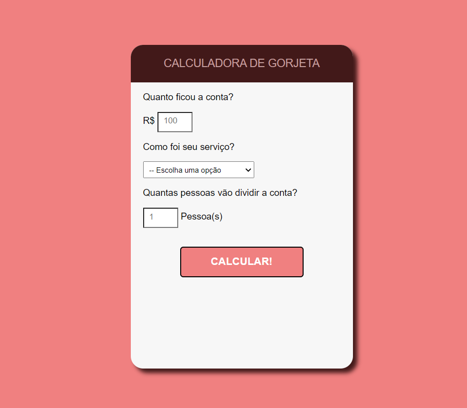

<h1 align="center"> Calculadora de Gorjetas </h1>

Evento exclusivo e gratuito, promovido pela OneBitCode.

  <a href="#-tecnologias">Tecnologias</a>&nbsp;&nbsp;&nbsp;|&nbsp;&nbsp;&nbsp;
  <a href="#-projeto">Projeto</a>&nbsp;&nbsp;&nbsp;|&nbsp;&nbsp;&nbsp;

 

  

## 🚀 Tecnologias

Esse projeto foi desenvolvido com as seguintes tecnologias:

- HTML e CSS
- JavaScript

 

## 💻 Projeto

A Calculadora de gorjetas, simula uma avaliação do serviço prestado, atraves da seleção do percentual, realiza o calculo e faz a divisão pela quantidade de pessoas.

